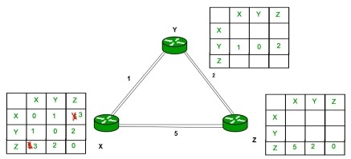
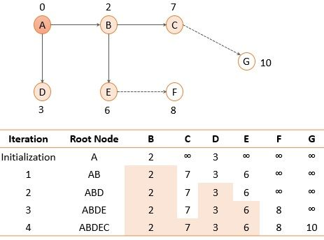

### Introduction

Routing protocols, according to the OSI routing framework, are layer management protocols for the network layer that specify how routers communicate with each other to distribute information and data that helps them to select routes between any two nodes on a computer network. Data packets are forwarded through the networks of the internet from one router to the other router until they reach their destination computer. Each router has a prior knowledge only of networks(nodes) attached to it directly. A routing protocol shares this information first among it’s immediate neighbours, and then throughout the network.  
There Are various Algorithms used for this, some of them discussed in our project are:  
Routing is divided into two categories:

1. Static Routing
2. Dynamic Routing
   - Routing Information Protocol (RIP)
   - Open Shortest Path First (OSPF)
   - Border Gateway Protocol (BGP)

### Dynamic Routing

Dynamic router, also called adaptive routing, is a process whereby a router can transmit data through a different route or on the one it is assigned depending on the current state of the communication circuits within the system. Dynamic routing uses complex routing algorithms that do not provide high security like static routing. When the network change occurs, it sends the message to the router to ensure that the routes are then recalculated for sending updated routing information. In short, dynamic routing is automated and does not require information to be entered manually like static routing. Dynamic routing is usually implemented in large networks.

### i) Routing Information Protocol (RIP)

Routing Information Protocol (RIP) is an implementation of the distance vector protocol. RIP is an intra-domain routing protocol used within an autonomous system. Here, intra-domain means routing the packets in a defined domain. It is one of the oldest dynamic routing protocols which uses hop count (number of routers occurring in between the source and destination network) as a routing metric to find the best path between the source and the destination network. Updates (routing information) is broadcasted, sending the entire updated table, the information is updated periodically (after every 30sec). It works on the principle of Bellman Ford Algorithm.

### Bellman-Ford’s Algorithm

The distance vector routing protocol uses the basic principle of the Bellman-Ford Algorithm to identify the shortest path through the network. So, let us take a quick review of Bellman-Ford’s algorithm.

To calculate the shortest distance follow the following steps:
- Initially, the cost or a distance of a node to itself is set to 0.
- The cost of a node to any other node is set to infinity ‘∞’ if the nodes are not connected directly.

The minimal distance between the two nodes in a graph is calculated using the method below:  
**Dij** = min {(Ci1 + D1j), (Ci2 + D2j), … (CiN + DNj)}  

where,  
- Dij shortest distance between node i and j,  
- Ci1 cost between node i and node 1  

This algorithm is repeated until we find the shortest distance vector between two nodes.

### Distance Vector Routing Algorithm

Bellman-Ford’s algorithm was designed with the view that we have all the initial information about each node in the graph at the same place. So, the Bellman-Ford algorithm was able to generate compensatory for each node synchronously.

In distance vector routing algorithm, we have to create the routing table for the routers in the autonomous system. In the autonomous system there can be changes like a new router has been added to the system or some network has stopped the services to a router or a link has failed.

In such situations, the routing table of every router must be updated asynchronously. Because a router has to update its routing table on the basis of information it receives from its neighbouring routers. So, the Bellman-Ford algorithm needs to be modified to design the distance vector routing algorithm:
- In distance vector routing algorithm, the cost is considered as the hop count (number of networks passed to reach the destination node). So a cost between two neighbouring routers is set to 1.
- Each router updates its routing table when it receives the information (distance vector) form the neighbouring routers.
- After updating its routing table, a router must forward its result to its neighbouring router. So that they can update their routing table.
- Each router keeps the three information in its routing table i.e., destination network, cost & the next hop.
- The router sends the information of each route as a record R.

**Example:**

Consider 3-routers X, Y and Z as shown in figure. Each router have their routing table. Every routing table will contain distance to the destination nodes.  

<figcaption><strong>Fig. 1 Routing table of X, Y and Z</strong></figcaption>

Consider router X , X will share it routing table to neighbors and neighbors will share it routing table to it to X and distance from node X to destination will be calculated using bellmen- ford equation.  
**Dx(y)** = min { C(x,v) + Dv(y)} for each node y ∈ N  

As we can see that distance will be less going from X to Z when Y is intermediate node(hop) so it will be update in routing table X.  

<figcaption><strong>Fig. 2 Updated routing table of X</strong></figcaption>

Similarly for Z also –  

<figcaption><strong>Fig. 3 Updated routing table of Y</strong></figcaption>

Finally the routing table for all –  

<figcaption><strong>Fig. 4 Final routing table</strong></figcaption>

### Advantages of RIP

- It is easy to configure.
- It has less complexity.
- The CPU utilization is less.

### Disadvantages of RIP

- In RIP, the route is chosen based on the hop count metric. If another route of better bandwidth is available, then that route would not be chosen.
- It broadcasts the routing updates to the entire network that creates a lot of traffic.
- RIP supports maximum 15 hops which means that the maximum 16 hops can be configured in a RIP.
- The RIP protocol has the highest Administrative distance value (i.e., 120), so it is not as reliable as the other routing protocols.

### ii) Open Shortest Path First (OSPF)

Open Shortest Path First is a routing protocol for Internet Protocol networks. It is an intra-domain protocol, which means that it is used within an area or a network. It works on the link state routing algorithm in which each router contains the information of every domain, and based on this information, it determines the shortest path. It falls into the group of interior gateway protocols, operating inside a single autonomous system. It works on the principle of Dijkstra's algorithm, also known as the shortest path first (SPF) algorithm. OSPF uses the flooding technique that is, it checks all possible routes between source and destination and picks the shortest route(best route).

**Initialization:**
- Select the root node.
- Set the shortest distance from the root node to every other node as the cost between the root node and that corresponding node.
- The shortest distance between root node to root node is 0.

**Iteration:** This step is repeated until all the routers are added to the root node. This step has two sub-steps:
- Add the next node: Search the next node that is not in the path of the root node and select node with minimum cost. Add the selected node to the path.
- Update: Now update the shortest distance for the rest of the nodes in the domain using the shortest distance of the node that we have just added to the path of step 2.

**Dj** = minimum (Dj, Di + cij) for all remaining nodes

Let us take an example, in the figure below, there is a topology of an AS.  

<figcaption><strong>Fig. 5 Link state example</strong></figcaption>

We will discuss how the shortest path tree for node A. First, we will initialize node A and set the shortest distance to its immediate neighbors.  

<figcaption><strong>Fig. 6 Initialization</strong></figcaption>

Among the two immediate neighbors of node A, we will add a node to the path that has the shortest distance i.e., node B with shortest distance 2.  

<figcaption><strong>Fig. 7 Routing table for node A after iteration 1</strong></figcaption>

Now search for the nodes that are not added to the path yet (C, D, E) and select the one with the shortest distance i.e., node D.  

<figcaption><strong>Fig. 8 Routing table for node A after iteration 2</strong></figcaption>

Now, nodes B and D that we added to the path were directly connected to root node A and were at the shortest distance as compared to any other path. Further, we have node E and node C which can be reached by node A through node B or through node D. Let us check out which path is shortest.  
Dj = minimum (Dj, Di + cij)  

DE = minimum ((2+4) B, (3+5) D)  
DE = minimum ((6) B, (8) D)  
DE = 6  

Here we will choose the path for node E through node B.  
Similarly, we will calculate the shortest distance for node C.  

DC = minimum (Dj, Di + cij)  
DC = minimum ((2+5) B, (3+5+2+4) D)  
DC = minimum ((7) B, (14) D)  
DC = 7  

Now, node E has the shortest distance so we will add node E to the path.  

<figcaption><strong>Fig. 9 Routing table for node A after iteration 3</strong></figcaption>

After adding node E to the path again explore the nodes that are not added to the path and there enlist their cost as the distance. Again select the node with the shortest distance so we will add node C to the path.  

<figcaption><strong>Fig. 10 Routing table for node A after iteration 4</strong></figcaption>

Now we are left with node F and node G. We will calculate the shortest distance for node F and G as we did for nodes E and C. Among F and G, the node with the shortest distance is node F. Therefore, we will update and add node F to the path.  

<figcaption><strong>Fig. 11 Routing table for node A after iteration 5</strong></figcaption>

Additionally, the root node A can reach node G through node F with the shortest distance, i.e., 9. Therefore, we finally add node G.

**Creating Routing Table**

Using the shortest path tree, each router generates a routing table consisting of three columns: destination, cost, and next router. The figure below displays a routing table for router A. Similarly, routing tables are created for all routers in the domain.  

<figcaption><strong>Fig. 12 Routing table for node A</strong></figcaption>

### Advantage of OSPF

- Unlimited hop counts.
- Load balancing with equal-cost routes for the same destination.

### Disadvantage of OSPF

- It is complex to configure and difficult to troubleshoot. In a large network, only experienced network administrators can configure it.
- It needs lots of information to calculate the best route for each destination. To store this information, OSPF consumes more memory than other routing protocols.
- It requires an extra CPU process to run the SPF algorithm.